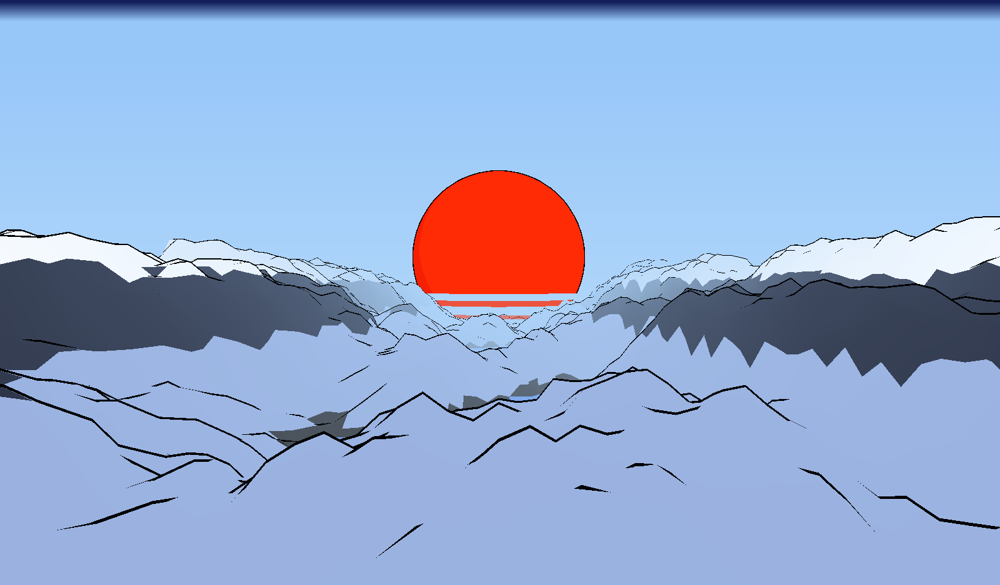

# RNG Landscape
A randomly-generated audio-responsive customizeable landscape for use in Wallpaper Engine.   

Coded in Javascript using the ThreeJS library.  
Terrain generated through layerimg various levels of noise (simplex2 and random).  
Customisation is achieved through the Wallpaper Engine editor, and is usable in all aspect ratios.

Steam Workshop Page: https://steamcommunity.com/sharedfiles/filedetails/?id=1971745290
